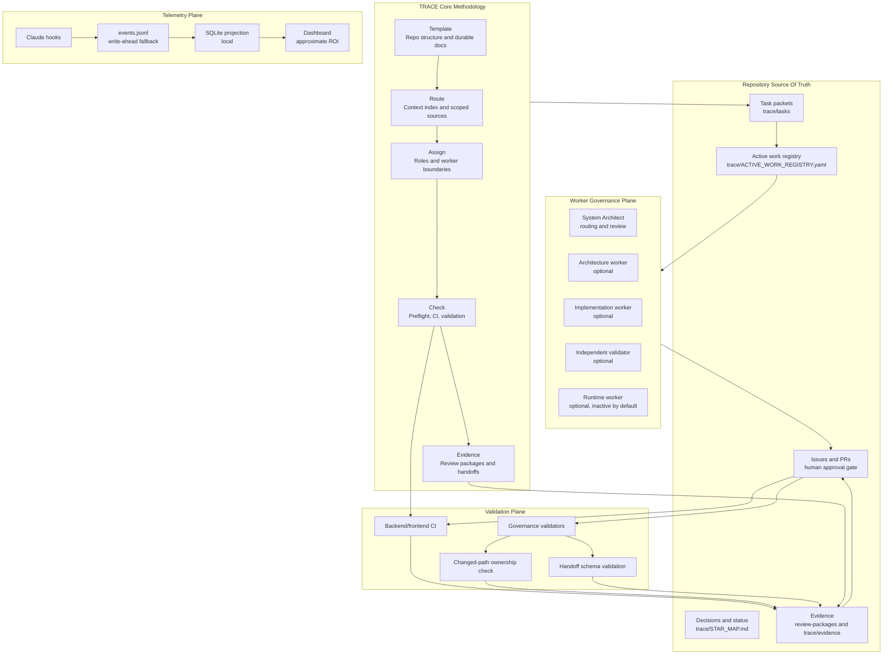
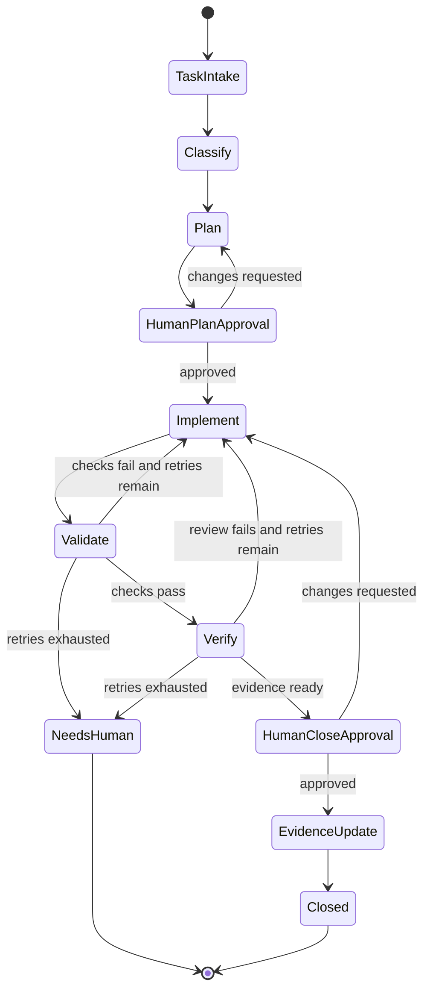
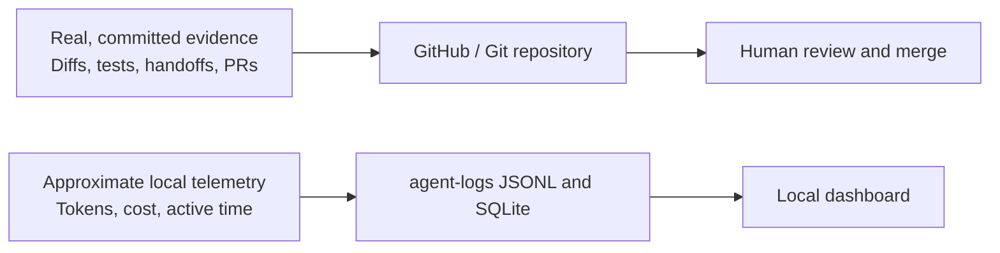

# TRACE Architecture

This page is the canonical editable architecture diagram. GitHub renders Mermaid diagrams directly in Markdown, so this file is the source of truth for the diagram. Existing PNG/SVG assets are fallback renders only.

## System Overview

## Execution Flow

## Data Contract

