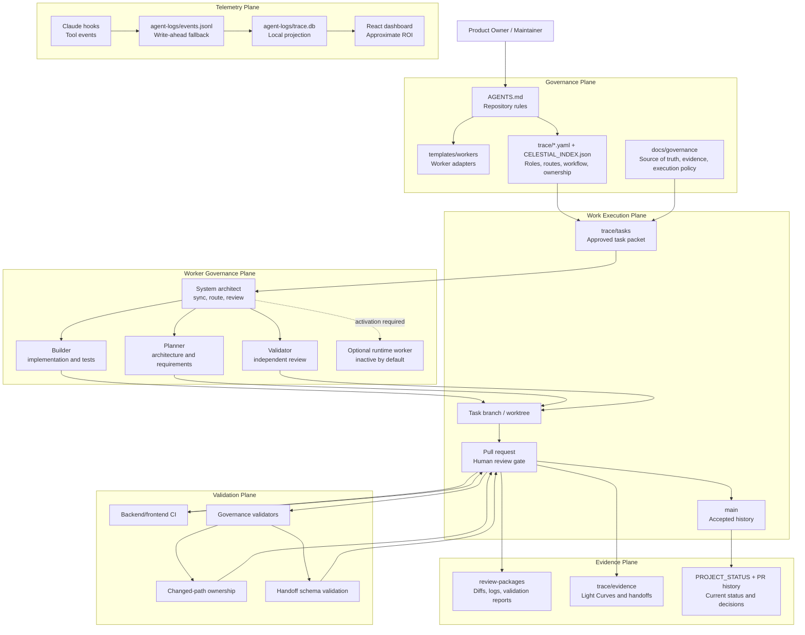
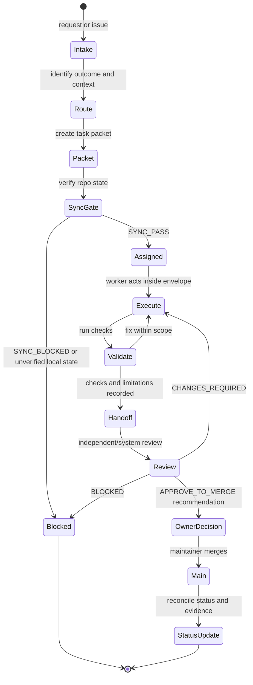
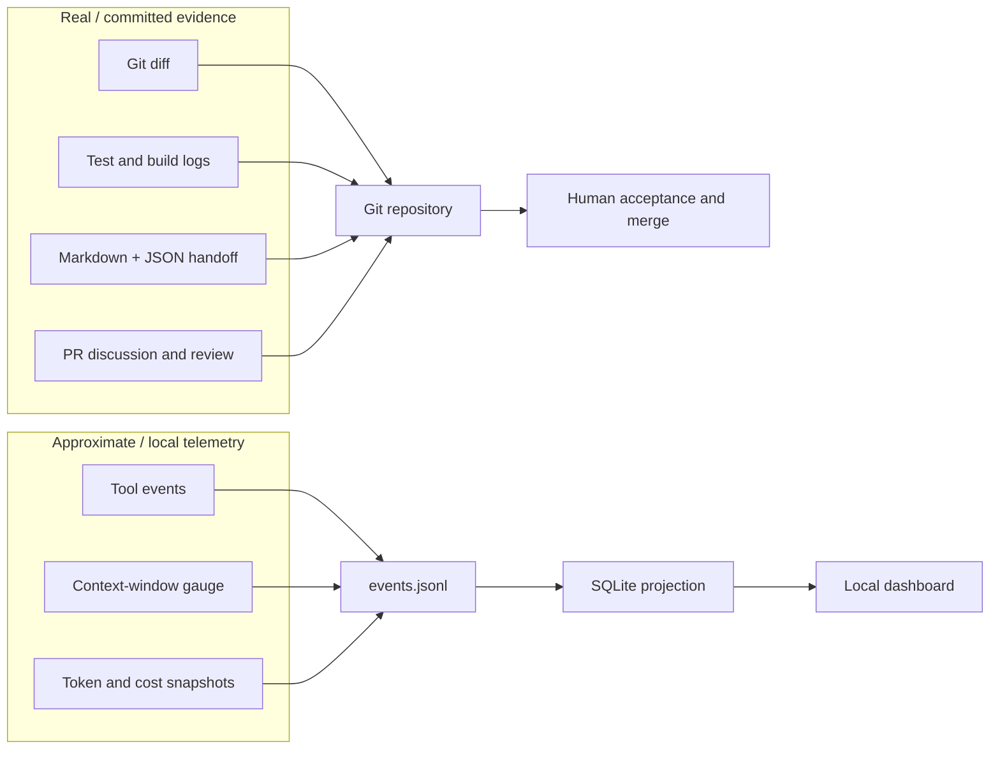

# TRACE Architecture

This is the canonical architecture document for TRACE. It uses Mermaid because GitHub
renders Mermaid directly in Markdown, making the diagram readable in the repository and in
pull requests without separate tooling.

Existing PNG/SVG files are fallback renders only. Update this file first when the
architecture changes.

## Reading Guide

TRACE separates three concerns that are often mixed together in AI-assisted development:

| Concern | Purpose | Durable location |
|---|---|---|
| Governance | Decide who may do what, under which task envelope | `trace/`, `docs/governance/`, `templates/workers/` |
| Evidence | Prove what changed, what passed, what failed, and what remains | `review-packages/`, `trace/evidence/`, PRs |
| Telemetry | Observe local agent/tool activity and approximate ROI | `agent-logs/`, SQLite, dashboard |

The repository is the source of truth. Chat is a coordination surface, not the system of
record.

## Architecture Overview

## Governed Task Lifecycle

Every meaningful change moves through an approved task envelope. Workers may choose the
method, but they may not widen scope, modify another task's owned paths, self-approve, or
merge.

## Data And Evidence Flow

TRACE deliberately separates real evidence from approximate telemetry.

## Component Responsibilities

| Component | Responsibility | What it must not do |
|---|---|---|
| `AGENTS.md` | Repository-level TRACE rules | Override human authority |
| `templates/workers/` | Reusable worker adapter templates | Make a worker mandatory |
| `trace/ACTIVE_WORK_REGISTRY.yaml` | Live task status and path ownership | Become a broad allowlist |
| `trace/WORKFLOWS.yaml` | Synchronization and lifecycle rules | Replace PR review |
| `trace/schemas/agent_handoff.schema.json` | Machine-checkable handoff contract | Claim a review happened before evidence exists |
| Governance validators | Check contracts, status vocabulary, routing, and ownership | Merge, accept risk, or make product decisions |
| Telemetry hooks | Observe local tool activity | Block security-sensitive actions by themselves |
| Dashboard | Display local live state and approximate ROI | Claim product acceptance or release |

## Important Boundaries

- Runtime workers are optional and inactive by default.
- Auto-research is draft/roadmap, not a live autonomous dispatch system.
- Evidence in Git is real; token, cost, and effort metrics are approximate unless explicitly
  backed by measured data.
- Public source visibility does not authorize public runtime exposure, cloud execution,
  external messaging, paid services, or credential use.

